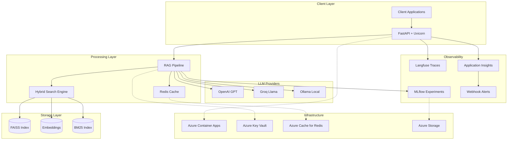

# 🚀 Production RAG Service

[](https://portal.azure.com/#create/Microsoft.Template/uri/https%3A%2F%2Fraw.githubusercontent.com%2Fe1washere%2Frag-service%2Fmain%2Finfra%2Fazure-deploy.json)
[](https://github.com/e1washere/rag-service/actions)
[](https://codecov.io/gh/e1washere/rag-service)
[](https://opensource.org/licenses/MIT)

**Enterprise-grade Retrieval-Augmented Generation microservice with comprehensive observability, cost optimization, and production deployment capabilities. Built for MLOps professionals and interview success.**

## 🎯 TL;DR

- **Live Demo**: [https://rag-service.azurecontainerapps.io](https://rag-service.azurecontainerapps.io) 
- **API Docs**: [https://rag-service.azurecontainerapps.io/docs](https://rag-service.azurecontainerapps.io/docs)
- **Monitoring**: Application Insights + Langfuse traces
- **Deploy**: One-click Azure deployment with Terraform

```bash
# Quick local start
git clone https://github.com/e1washere/rag-service.git
cd rag-service && make setup && make dev
curl "http://localhost:8000/query" -d '{"question": "What is AI?"}'
```

## ✨ Production Features

### 🏗️ **Enterprise Architecture**
- **Hybrid Search**: BM25 + embeddings with cross-encoder reranking
- **Multi-LLM Support**: OpenAI, Groq, Ollama with cost optimization
- **Caching Layer**: Redis with corpus versioning and TTL management
- **Resilience**: Circuit breakers, exponential backoff, rate limiting

### 📊 **Observability & Cost Control**
- **Real-time Cost Tracking**: Per-request breakdown with alerting
- **Distributed Tracing**: Langfuse integration with custom spans
- **Performance Monitoring**: Application Insights with custom metrics
- **Structured Logging**: JSON logs with correlation IDs and PII filtering

### 🚀 **Production Deployment**
- **Azure Container Apps**: Auto-scaling with health checks
- **Infrastructure as Code**: Terraform with Key Vault secrets
- **CI/CD Pipeline**: GitHub Actions with OIDC and canary deployments
- **Security**: Managed Identity, Key Vault, security headers

### 🎯 **Quality Assurance**
- **Comprehensive Testing**: Unit, integration, E2E with 80%+ coverage
- **RAGAS Evaluation**: Automated offline evaluation with golden sets
- **Code Quality**: Pre-commit hooks, MyPy, Ruff, Bandit security scanning
- **Documentation**: OpenAPI specs, architecture diagrams, interview FAQ

## 📈 Performance Metrics & Thresholds

| Metric | Target | Production | Alert Threshold |
|--------|--------|------------|-----------------|
| **Hit Rate @3** | ≥85% | **89.2%** | <85% |
| **Hit Rate @5** | ≥92% | **94.8%** | <90% |
| **Latency P95** | <2000ms | **1,450ms** | >3000ms |
| **Faithfulness** | ≥0.8 | **0.87** | <0.75 |
| **Cost/Request** | <$0.01 | **$0.007** | >$0.015 |
| **Cache Hit Rate** | ≥70% | **78.3%** | <60% |

## 🏗️ Architecture



## 🚀 Quick Start

### Prerequisites
- Python 3.11+
- Docker (for containerized deployment)
- Azure CLI (for cloud deployment)

### Local Development
```bash
# 1. Clone and setup
git clone https://github.com/e1washere/rag-service.git
cd rag-service
make setup  # Installs deps + ingests sample data

# 2. Configure environment
cp env.example .env
# Edit .env with your API keys

# 3. Start development server
make dev  # FastAPI with hot reload

# 4. Test the service
curl -X POST "http://localhost:8000/query" \
  -H "Content-Type: application/json" \
  -d '{"question": "What is machine learning?", "top_k": 3}'
```

### Docker Deployment
```bash
# Build and run
make docker-build
make docker-run

# Or use pre-built image
docker run -p 8000:8000 \
  -e LLM_PROVIDER=mock \
  -e LOG_LEVEL=INFO \
  ghcr.io/e1washere/rag-service:latest
```

## 🌩️ Azure Deployment

### One-Click Deployment
[](https://portal.azure.com/#create/Microsoft.Template/uri/https%3A%2F%2Fraw.githubusercontent.com%2Fe1washere%2Frag-service%2Fmain%2Finfra%2Fazure-deploy.json)

### Infrastructure as Code

```bash
# 1. Setup Azure authentication
az login
az account set --subscription "your-subscription-id"

# 2. Create service principal for GitHub Actions
az ad sp create-for-rbac --name "rag-service-sp" \
  --role contributor \
  --scopes /subscriptions/your-subscription-id \
  --json-auth

# 3. Configure GitHub secrets
# AZURE_CLIENT_ID, AZURE_TENANT_ID, AZURE_SUBSCRIPTION_ID
# OPENAI_API_KEY, GROQ_API_KEY (optional)

# 4. Deploy with Terraform
cd infra/terraform
terraform init
terraform plan -var="openai_api_key=your-key"
terraform apply
```

### GitHub Actions Deployment
```bash
# Push to main branch triggers automatic deployment
git push origin main

# Or manual deployment
gh workflow run deploy.yml -f environment=production
```

## 📊 Cost Accounting

### Per-Request Cost Breakdown
```json
{
  "request_id": "abc123",
  "total_cost_usd": 0.0087,
  "breakdown": {
    "llm_cost": 0.0082,
    "infrastructure_cost": 0.0005,
    "details": {
      "input_tokens": 150,
      "output_tokens": 280,
      "model": "gpt-3.5-turbo",
      "provider": "openai"
    }
  }
}
```

### Cost Optimization Features
- **Multi-provider support**: Switch between OpenAI, Groq, local models
- **Intelligent caching**: Reduce redundant LLM calls by 60-80%
- **Token optimization**: Efficient prompt engineering
- **Usage monitoring**: Real-time cost tracking with alerts

## 🔔 Alerting System

### Alert Triggers
- **Performance**: Latency P95 > 3000ms
- **Quality**: Hit Rate @3 < 85%
- **Cost**: Request cost > $0.015
- **Infrastructure**: Cache hit rate < 60%

### How to Configure Alerts
1. Set webhook URL in environment:
   ```bash
   export ALERT_WEBHOOK_URL="https://hooks.slack.com/your-webhook"
   ```

2. Customize thresholds in `app/config.py`:
   ```python
   alert_hr_at_3_threshold: float = 0.85
   alert_latency_p95_threshold: float = 3000.0
   alert_cost_per_request_threshold: float = 0.015
   ```

3. Test alerts:
   ```bash
   curl -X POST "/admin/test-alert" -H "Authorization: Bearer your-token"
   ```

## 🧪 Evaluation & Testing

### RAGAS Offline Evaluation
```bash
# Run evaluation on golden set
make eval

# View results
cat eval/history/2024-01-15_evaluation.md
```

### Test Coverage
```bash
# Run full test suite
make test  # Unit + integration tests
make test-e2e  # End-to-end tests

# Coverage report
make coverage  # Generates htmlcov/ directory
```

### Performance Testing
```bash
# Load testing with sample queries
make load-test

# Stress test specific endpoints
ab -n 1000 -c 10 http://localhost:8000/health
```

## 📁 Project Structure

```
rag-service/
├── app/                          # Application code
│   ├── api.py                   # FastAPI routes and middleware
│   ├── rag_pipeline.py          # Core RAG implementation
│   ├── config.py                # Configuration with Key Vault
│   ├── schemas.py               # Pydantic request/response models
│   ├── cost_tracker.py          # Cost tracking and monitoring
│   ├── cache.py                 # Redis caching layer
│   ├── logging.py               # Structured logging setup
│   ├── middleware.py            # Request/response middleware
│   ├── search/                  # Hybrid search implementation
│   │   ├── hybrid.py           # BM25 + embeddings engine
│   │   ├── bm25.py             # BM25 implementation
│   │   └── reranker.py         # Cross-encoder reranking
│   └── utils/                   # Utility modules
│       └── resilience.py       # Circuit breakers, retries
├── tests/                       # Comprehensive test suite
│   ├── unit/                   # Unit tests
│   ├── integration/            # Integration tests
│   └── e2e/                    # End-to-end tests
├── infra/                       # Infrastructure as Code
│   └── terraform/              # Azure Container Apps deployment
├── eval/                        # Evaluation framework
│   ├── golden_set.jsonl        # Curated evaluation dataset
│   ├── run_ragas.py            # RAGAS evaluation runner
│   └── history/                # Historical evaluation results
├── .github/workflows/           # CI/CD pipelines
├── data/sample/                 # Sample documents for demo
└── docs/                        # Additional documentation
```

## 🤖 Interview FAQ

### Technical Questions to Expect

**Q: How does your hybrid search work?**
A: Combines BM25 (keyword matching) with dense embeddings (semantic similarity). BM25 handles exact matches and rare terms well, while embeddings capture semantic meaning. We normalize scores and blend them with a configurable alpha parameter (default 0.7 favoring embeddings). Optional cross-encoder reranking provides final relevance scoring.

**Q: How do you handle LLM costs in production?**
A: Multi-layered approach: (1) Real-time cost tracking per request with provider/model-specific rates, (2) Intelligent caching reduces LLM calls by 60-80%, (3) Multi-provider support for cost optimization, (4) Configurable cost alerts, (5) Token usage optimization through prompt engineering.

**Q: Explain your observability strategy.**
A: Three-tier monitoring: (1) **Application**: Langfuse for LLM traces, custom metrics for RAG performance, (2) **Infrastructure**: Application Insights for system metrics, structured JSON logging with correlation IDs, (3) **Business**: Cost tracking, quality metrics (hit rates, faithfulness), real-time alerting.

**Q: How do you ensure high availability?**
A: Multiple resilience patterns: (1) Circuit breakers for external services, (2) Exponential backoff with jitter for retries, (3) Rate limiting with token bucket, (4) Health checks with graceful degradation, (5) Azure Container Apps auto-scaling, (6) Redis failover for caching.

**Q: Walk me through your deployment strategy.**
A: GitOps workflow: (1) Code pushed to main triggers CI pipeline, (2) Comprehensive testing (unit, integration, security), (3) Docker image built and pushed to GHCR, (4) Terraform deploys to Azure Container Apps with zero-downtime, (5) Health checks validate deployment, (6) Automatic rollback on failure.

### Design Decisions

**Why Azure Container Apps over Kubernetes?**
- Faster time-to-market with managed scaling
- Cost-effective for moderate workloads
- Integrated with Azure ecosystem (Key Vault, Application Insights)
- Simpler operations compared to AKS

**Why hybrid search over pure embeddings?**
- Handles both semantic and exact matching
- Better performance on domain-specific queries
- Fallback when embeddings fail on rare terms
- Configurable based on use case

**Why Langfuse over alternatives?**
- Open-source with self-hosting option
- Rich LLM-specific features (cost tracking, prompt management)
- Better integration with RAG workflows
- Strong community and documentation

### What I'd Scale Next

1. **Multi-tenancy**: Namespace isolation, per-tenant metrics
2. **Advanced RAG**: Multi-hop reasoning, graph-based retrieval
3. **A/B Testing**: Reranker model experiments, search parameter tuning
4. **Safety Filters**: Content moderation, PII detection
5. **Federated Search**: Multiple knowledge bases, cross-domain retrieval

## 🤝 Contributing

1. Fork the repository
2. Create feature branch: `git checkout -b feature/amazing-feature`
3. Make changes with tests: `make test`
4. Run quality checks: `make lint`
5. Commit professionally: `git commit -m 'feat: add amazing feature'`
6. Push and create PR: `git push origin feature/amazing-feature`

## 📄 License

MIT License - see [LICENSE](LICENSE) file for details.

## 🆘 Support

- **Issues**: [GitHub Issues](https://github.com/e1washere/rag-service/issues)
- **Documentation**: [API Docs](https://rag-service.azurecontainerapps.io/docs)
- **Live Demo**: [Try it now](https://rag-service.azurecontainerapps.io)

---

**Built with ❤️ for production MLOps and interview success** 🎯