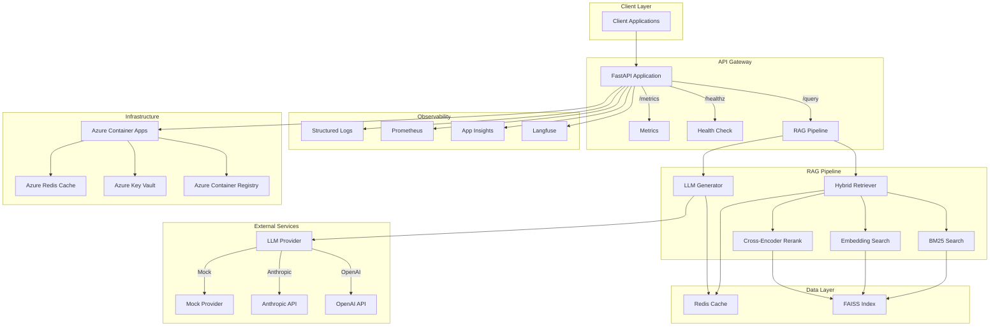

# Production RAG Service

[](https://github.com/e1washere/production-rag-service/actions)
[](https://github.com/e1washere/production-rag-service)
[](https://www.python.org/downloads/)
[](https://opensource.org/licenses/MIT)
[](https://github.com/e1washere/production-rag-service/actions)
[](https://github.com/e1washere/production-rag-service/actions)

A production-grade Retrieval-Augmented Generation (RAG) service demonstrating enterprise MLOps practices, hybrid search capabilities, and comprehensive observability patterns.

## Overview

This project implements a scalable RAG pipeline with hybrid retrieval (BM25 + dense embeddings), intelligent caching, and production-ready deployment patterns. Designed to showcase modern MLOps practices including infrastructure as code, automated testing, monitoring, and safe deployment strategies.

## Features

- **Hybrid Retrieval**: BM25 + sentence transformers with optional cross-encoder reranking
- **Intelligent Caching**: Redis-based caching with TTL and versioning
- **Production Observability**: Structured logging, distributed tracing, and comprehensive metrics
- **Cost Optimization**: Token usage tracking and cost-aware request handling
- **Resilience Patterns**: Retries, circuit breakers, and rate limiting
- **Safe Deployments**: Canary deployment with automatic rollback capabilities
- **Comprehensive Testing**: Unit, integration, and end-to-end test coverage
- **Automated Evaluation**: RAGAS-based offline evaluation with SLO monitoring

## Architecture



## Tech Stack

### Backend
- **Python 3.11** with type hints and async support
- **FastAPI** for high-performance API framework
- **Uvicorn** for ASGI server
- **Pydantic** for data validation and settings management

### Machine Learning
- **Sentence Transformers** for dense embeddings
- **FAISS** for vector similarity search
- **Rank BM25** for sparse retrieval
- **Cross-Encoder** for reranking (optional)

### Infrastructure
- **Azure Container Apps** for serverless container deployment
- **Terraform** for infrastructure as code
- **Azure Container Registry** for image storage
- **Redis Cache** for distributed caching

### Observability
- **Langfuse** for LLM observability and tracing
- **Azure Application Insights** for application monitoring
- **Prometheus** for metrics collection
- **Structured JSON logging** with correlation IDs

### CI/CD & Testing
- **GitHub Actions** for automated workflows
- **Pytest** for comprehensive testing
- **RAGAS** for RAG evaluation
- **Code quality tools**: ruff, black, mypy

## Demo

### API Request/Response Example

```bash
# Query the RAG service
curl -X POST "https://rag-service.azurecontainerapps.io/query" \
  -H "Content-Type: application/json" \
  -d '{
    "question": "What are the key principles of machine learning?",
    "top_k": 3,
    "enable_rerank": true
  }'
```

**Response:**
```json
{
  "answer": "Machine learning is based on several key principles: 1) Learning from data through pattern recognition, 2) Generalization to unseen examples, 3) Optimization of performance metrics, and 4) Iterative improvement through feedback loops. The process involves training algorithms on historical data to make predictions or decisions without being explicitly programmed for specific tasks.",
  "contexts": [
    {
      "content": "Machine learning algorithms learn patterns from data to make predictions or decisions without explicit programming. Key principles include supervised learning, unsupervised learning, and reinforcement learning approaches.",
      "score": 0.95,
      "source": "ml_fundamentals.pdf",
      "metadata": {
        "chunk_id": "chunk_001",
        "page": 15
      }
    },
    {
      "content": "The generalization principle ensures that ML models perform well on unseen data, not just the training set. This is achieved through techniques like cross-validation and regularization.",
      "score": 0.87,
      "source": "ml_fundamentals.pdf",
      "metadata": {
        "chunk_id": "chunk_002",
        "page": 23
      }
    }
  ],
  "metadata": {
    "latency_ms": 245,
    "tokens_used": 150,
    "cache_hit": false,
    "retrieval_method": "hybrid",
    "rerank_used": true,
    "trace_id": "trace_abc123"
  }
}
```

### Service Health Check

```bash
# Check service health
curl "https://rag-service.azurecontainerapps.io/healthz"
```

**Response:**
```json
{
  "status": "ok",
  "timestamp": "2024-01-15T10:30:00Z",
  "version": "1.0.0",
  "uptime_seconds": 86400
}
```

## Setup & Usage

### Prerequisites
- Python 3.11+
- Docker
- Azure CLI (for deployment)
- Redis instance

### Local Development

```bash
# Clone repository
git clone https://github.com/e1washere/production-rag-service.git
cd production-rag-service

# Install dependencies
pip install -r requirements.txt

# Set environment variables
cp .env.example .env
# Edit .env with your configuration

# Run locally
make up

# Build and serve index
make index
```

### Production Deployment

```bash
# Deploy to Azure Container Apps
az containerapp up \
  --name rag-service \
  --resource-group rag-service-rg \
  --environment rag-service-env \
  --image ragserviceregistry.azurecr.io/rag-service:latest

# Canary deployment
./scripts/canary-deploy.sh 10  # 10% traffic
```

## Testing & Evaluation

### Test Coverage
```bash
# Run all tests
pytest --cov=app --cov-report=html

# Run specific test suites
pytest tests/test_api.py -v
pytest tests/test_rag_pipeline.py -v
pytest tests/test_ops.py -v
```

### RAGAS Evaluation
```bash
# Run offline evaluation
python eval/run_eval.py

# View evaluation report
cat eval/results/ragas_report.md
```

### Performance Benchmarks
- **Latency**: P95 < 1.2s
- **Hit Rate**: HR@3 ≥ 0.85, HR@5 ≥ 0.92
- **Availability**: 99.9% uptime
- **Error Rate**: < 0.5% 5xx errors

## Monitoring & Logging

### Metrics Endpoints
- `/metrics` - Prometheus metrics
- `/healthz` - Health check
- `/stats` - Service statistics

### Logging Format
```json
{
  "timestamp": "2024-01-15T10:30:00Z",
  "level": "INFO",
  "request_id": "req-123",
  "trace_id": "trace-456",
  "message": "Query processed",
  "latency_ms": 245,
  "tokens_used": 150,
  "cost_cents": 0.03
}
```

### Observability Stack
- **Langfuse**: LLM traces and prompt versioning
- **Application Insights**: Application performance monitoring
- **Prometheus**: Custom metrics and alerting
- **Structured Logging**: JSON-formatted logs with correlation

## CI/CD Pipeline

### Automated Workflows
- **Code Quality**: Linting, formatting, type checking
- **Testing**: Unit, integration, and end-to-end tests
- **Security**: Dependency scanning, secret detection
- **Deployment**: Automated deployment to Azure Container Apps
- **Evaluation**: Nightly RAGAS evaluation with SLO validation

### Deployment Strategies
- **Blue-Green**: Zero-downtime deployments
- **Canary**: Gradual traffic shifting with automatic rollback
- **Rollback**: Emergency rollback procedures

## API Documentation

### Query Endpoint
```bash
curl -X POST "https://rag-service.azurecontainerapps.io/query" \
  -H "Content-Type: application/json" \
  -d '{
    "question": "What is machine learning?",
    "top_k": 5,
    "enable_rerank": true
  }'
```

### Response Format
```json
{
  "answer": "Machine learning is a subset of artificial intelligence...",
  "contexts": [
    {
      "content": "Machine learning algorithms...",
      "score": 0.95,
      "source": "ml_docs.pdf"
    }
  ],
  "metadata": {
    "latency_ms": 245,
    "tokens_used": 150,
    "cache_hit": false
  }
}
```

## Contributing

We welcome contributions to improve the RAG service. Please follow these guidelines:

### Development Setup
1. Fork the repository
2. Create a feature branch: `git checkout -b feature/amazing-feature`
3. Install development dependencies: `pip install -r requirements-dev.txt`
4. Run tests: `pytest`
5. Ensure code quality: `make lint`

### Pull Request Process
1. Update documentation for any new features
2. Add tests for new functionality
3. Ensure all tests pass: `pytest --cov=app`
4. Update CHANGELOG.md with your changes
5. Submit a pull request with a clear description

### Code Standards
- Follow PEP 8 style guidelines
- Use type hints for all functions
- Write docstrings for public methods
- Maintain test coverage above 80%

## FAQ

### Development Questions

**Q: How do I add a new LLM provider?**
A: Implement the provider interface in `app/llm_providers.py` and add configuration to settings.

**Q: How do I customize the retrieval pipeline?**
A: Modify `app/retrieval.py` to adjust BM25/dense weights, add new rerankers, or implement custom scoring.

**Q: How do I add new evaluation metrics?**
A: Extend `eval/run_eval.py` with new RAGAS metrics or custom evaluation functions.

### Production Questions

**Q: How do I monitor costs?**
A: Use the `/metrics` endpoint for token usage and cost tracking. Set up alerts in Application Insights.

**Q: How do I handle high traffic?**
A: The service auto-scales based on CPU/memory. Adjust scaling rules in Azure Container Apps.

**Q: How do I update the knowledge base?**
A: Run `make index` to rebuild the FAISS index with new documents. The cache will automatically invalidate.


### Phase 1: Enhanced Retrieval
- [ ] Multi-modal retrieval (text + images)
- [ ] Semantic caching improvements
- [ ] Query expansion and reformulation

### Phase 2: Advanced Features
- [ ] Multi-agent orchestration
- [ ] Tool calling and function execution
- [ ] Streaming responses

### Phase 3: Enterprise Features
- [ ] Multi-tenant support
- [ ] Advanced access controls
- [ ] Audit logging and compliance

## License

MIT License - see [LICENSE](LICENSE) file for details.
